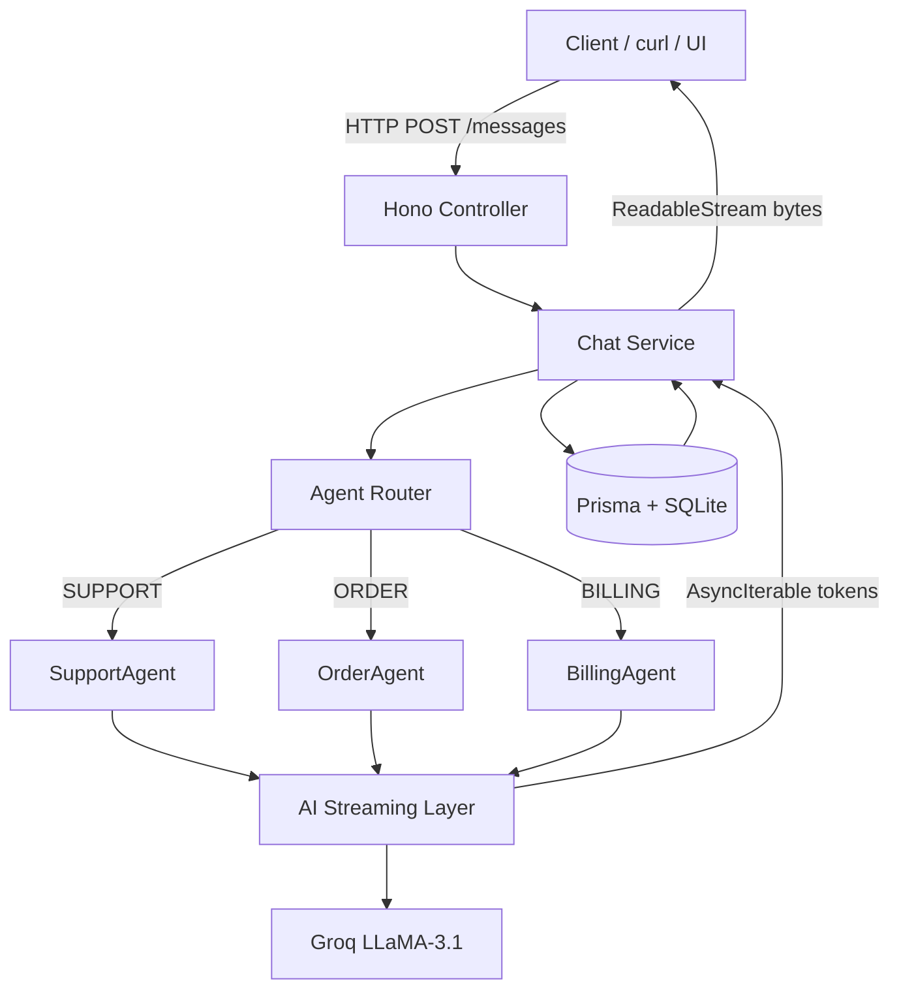

# AI Support Backend

A production-style backend for a multi‑agent AI customer support system with **real-time streaming**, **persistent conversation memory**, and **role‑based agent routing**. Built to demonstrate clean backend architecture, correct Node.js streaming, and modern LLM integration.

---

## ✨ Key Features

- **Multi‑agent routing** – Support, Order, and Billing agents selected dynamically
- **Real-time AI streaming** – Token-level streaming using Node‑correct `AsyncIterable` handling
- **Persistent conversation memory** – Conversations and messages stored via Prisma
- **Provider‑agnostic LLM layer** – Currently using Groq (LLaMA‑3.1), easily swappable
- **Strong TypeScript boundaries** – Clear contracts between layers
- **Production‑style separation of concerns**

---

## 🧠 High‑Level Architecture



---

## 🧩 Component Breakdown

### 1. Controller Layer (`controllers/`)

- Accepts HTTP requests
- Validates input
- Delegates to service layer
- Returns streamed responses via Hono

**Responsibility:** Transport only (no business logic)

---

### 2. Service Layer (`services/chat.service.ts`)

- Creates / validates conversations
- Persists user and assistant messages
- Fetches conversation history
- Converts `AsyncIterable<string>` → `ReadableStream<Uint8Array>`

**This is the orchestration layer.**

---

### 3. Agent Router (`agents/router.agent.ts`)

- Lightweight intent routing
- Maps messages to agent roles:
  - SUPPORT
  - ORDER
  - BILLING

Can later be replaced by an LLM‑based router.

---

### 4. Agent Layer (`agents/*.agent.ts`)

- Each agent defines:
  - Its system prompt
  - Its domain responsibility

Agents are **stateless** and operate purely on conversation history.

---

### 5. Streaming / LLM Layer (`ai/streaming.ts`)

- Wraps the AI SDK
- Builds `ModelMessage[]` from history
- Calls `streamText()`
- Exposes:
  - `textStream` → `AsyncIterable<string>`
  - `text` → final response promise

This layer is **provider‑agnostic**.

---

### 6. Persistence Layer (`tools/conversation.tool.ts`)

- Prisma ORM
- Enforced relational integrity

**Schema:**
- `Conversation`
- `Message` (FK → Conversation)

---

## 🔁 Request Flow (End‑to‑End)

1. Client sends `POST /messages`
2. Controller passes request to service
3. Service:
   - Creates or validates conversation
   - Saves user message
   - Fetches history
4. Router selects agent
5. Agent calls streaming layer
6. LLM streams tokens (`AsyncIterable`)
7. Service converts tokens → byte stream
8. Client receives streamed response
9. Full assistant response persisted after stream completes

---

## 🧪 Example Usage

### Start server

```bash
npx tsx src/server.ts
```

### Send first message

```bash
curl -N -X POST http://localhost:3000/messages \
  -H "Content-Type: application/json" \
  -d '{"message":"hello"}'
```

### Continue conversation

```bash
curl -N -X POST http://localhost:3000/messages \
  -H "Content-Type: application/json" \
  -d '{
    "conversationId":"<ID_FROM_PREVIOUS_RESPONSE>",
    "message":"refund my payment"
  }'
```

---

## 🛠 Tech Stack

- **Runtime:** Node.js
- **Framework:** Hono
- **Language:** TypeScript
- **ORM:** Prisma
- **Database:** SQLite (dev)
- **LLM Provider:** Groq (LLaMA‑3.1‑8B‑Instant)
- **Streaming:** AsyncIterable → Web ReadableStream

---

## 🚀 Why This Architecture

- Correct handling of **Node vs Edge streaming differences**
- Clean separation between AI logic and HTTP transport
- Easy extensibility (new agents, tools, providers)
- Suitable as a foundation for real production systems

---

## 🔮 Possible Extensions

- Frontend chat UI (React / Next.js)
- SSE support for browsers
- LLM‑based agent routing
- Tool calling (order lookup, refunds, etc.)
- Auth + user‑scoped conversations

---

## 📌 Status

✅ Streaming works
✅ Memory works
✅ Routing works

This project is **complete and portfolio‑ready**.

